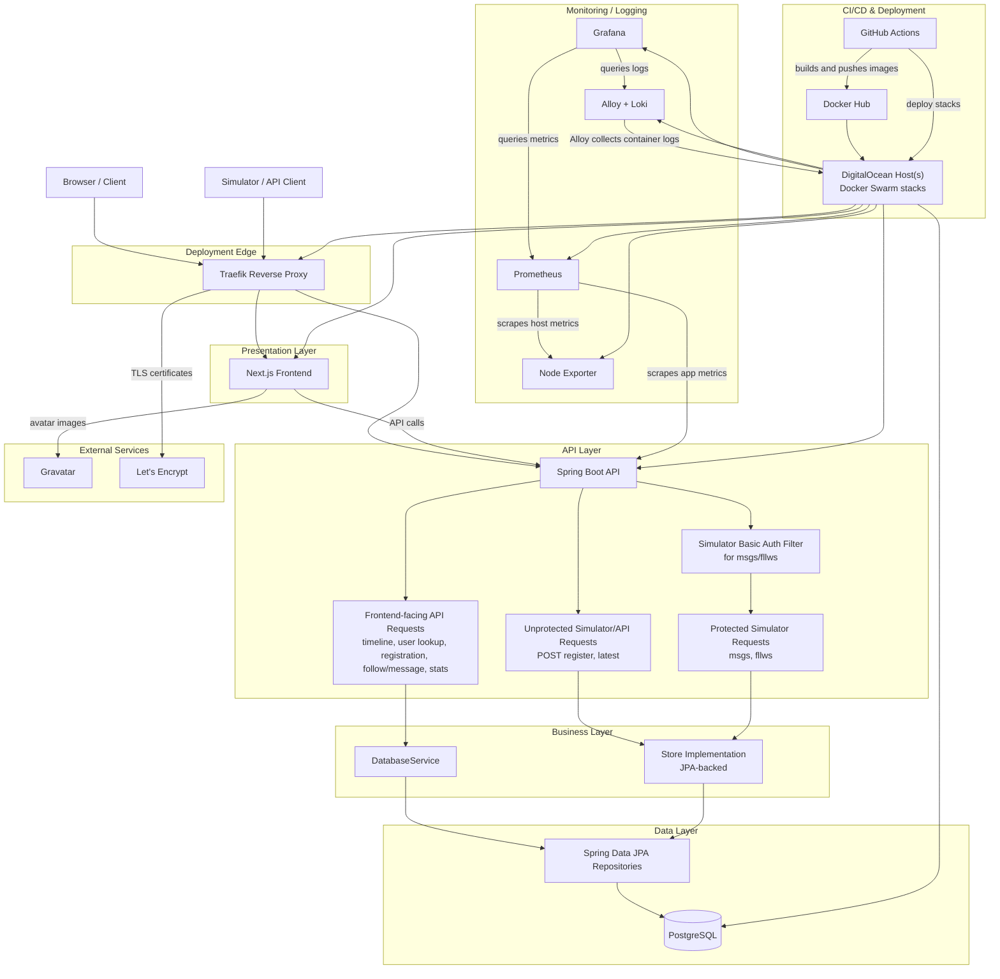

# Architecture Diagram

```mermaid
graph TD
    Client["Browser / Client"]
    Simulator["Simulator / API Client"]

    subgraph Edge["Deployment Edge"]
        Traefik["Traefik Reverse Proxy"]
    end

    subgraph Presentation["Presentation Layer"]
        Next["Next.js Frontend"]
    end

    subgraph API["API Layer"]
        Spring["Spring Boot API"]
        WebReq["Frontend-facing API Requests<br/>timeline, user lookup, registration, follow/message, stats"]
        SimPublic["Unprotected Simulator/API Requests<br/>POST register, latest"]
        SimAuth["Simulator Basic Auth Filter<br/>for msgs/fllws"]
        SimReq["Protected Simulator Requests<br/>msgs, fllws"]
    end

    subgraph Business["Business Layer"]
        DatabaseService["DatabaseService"]
        Store["Store Implementation<br/>JPA-backed"]
    end

    subgraph Data["Data Layer"]
        Repositories["Spring Data JPA Repositories"]
        DB[("PostgreSQL")]
    end

    subgraph Monitoring["Monitoring / Logging"]
        NodeExporter["Node Exporter"]
        Prometheus["Prometheus"]
        Grafana["Grafana"]
        Logs["Alloy + Loki"]
    end

    subgraph Deployment["CI/CD & Deployment"]
        Actions["GitHub Actions"]
        Registry["Docker Hub"]
        Swarm["DigitalOcean Host(s)<br/>Docker Swarm stacks"]
    end

    subgraph External["External Services"]
        Gravatar["Gravatar"]
        LetsEncrypt["Let's Encrypt"]
    end

    Client --> Traefik
    Simulator --> Traefik
    Traefik --> Next
    Traefik --> Spring
    Next -->|API calls| Spring
    Next -->|avatar images| Gravatar
    Traefik -->|TLS certificates| LetsEncrypt

    Spring --> WebReq
    Spring --> SimPublic
    Spring --> SimAuth
    SimAuth --> SimReq
    WebReq --> DatabaseService
    SimPublic --> Store
    SimReq --> Store
    DatabaseService --> Repositories
    Store --> Repositories
    Repositories --> DB

    Prometheus -->|scrapes app metrics| Spring
    Prometheus -->|scrapes host metrics| NodeExporter
    Grafana -->|queries metrics| Prometheus
    Grafana -->|queries logs| Logs
    Logs -->|Alloy collects container logs| Swarm

    Actions -->|builds and pushes images| Registry
    Registry --> Swarm
    Actions -->|deploy stacks| Swarm
    Swarm --> Traefik
    Swarm --> Next
    Swarm --> Spring
    Swarm --> DB
    Swarm --> Prometheus
    Swarm --> Grafana
    Swarm --> Logs
    Swarm --> NodeExporter
```
