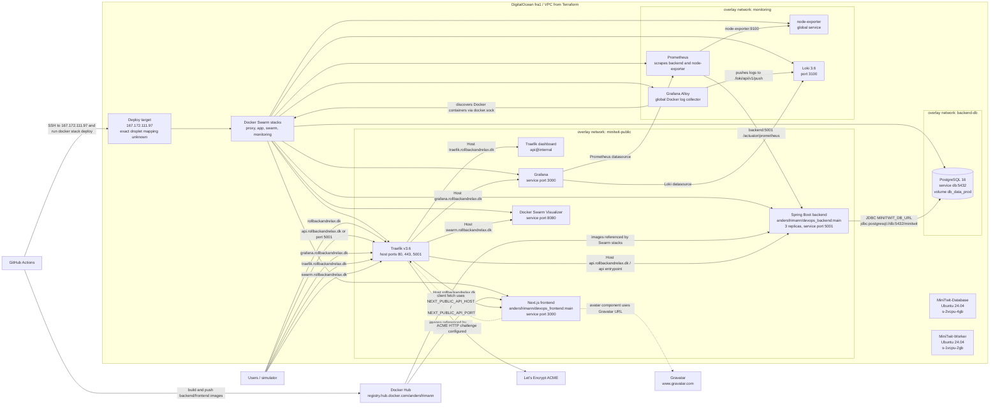

# Deployment Diagram

```mermaid
flowchart LR
  Users["Users / simulator"]
  GitHub["GitHub Actions"]
  DockerHub["Docker Hub<br/>registry.hub.docker.com/andersfrimann"]
  LetsEncrypt["Let's Encrypt ACME"]
  Gravatar["Gravatar<br/>www.gravatar.com"]

  GitHub -->|"build and push backend/frontend images"| DockerHub
  GitHub -->|"SSH to 167.172.111.97 and run docker stack deploy"| DeployHost["Deploy target<br/>167.172.111.97<br/>exact droplet mapping unknown"]

  subgraph DigitalOcean["DigitalOcean fra1 / VPC from Terraform"]
    MainDroplet["MiniTwit-Database<br/>Ubuntu 24.04<br/>s-2vcpu-4gb"]
    WorkerDroplet["MiniTwit-Worker<br/>Ubuntu 24.04<br/>s-1vcpu-2gb"]
    Swarm["Docker Swarm stacks<br/>proxy, app, swarm, monitoring"]

    DeployHost --> Swarm

    subgraph PublicNet["overlay network: minitwit-public"]
      Traefik["Traefik v3.6<br/>host ports 80, 443, 5001"]
      TraefikDashboard["Traefik dashboard<br/>api@internal"]
      Frontend["Next.js frontend<br/>andersfrimann/devops_frontend:main<br/>service port 3000"]
      Backend["Spring Boot backend<br/>andersfrimann/devops_backend:main<br/>3 replicas, service port 5001"]
      Grafana["Grafana<br/>service port 3000"]
      Visualizer["Docker Swarm Visualizer<br/>service port 8080"]
    end

    subgraph BackendDbNet["overlay network: backend-db"]
      Postgres[("PostgreSQL 16<br/>service db:5432<br/>volume db_data_prod")]
    end

    subgraph MonitoringNet["overlay network: monitoring"]
      Prometheus["Prometheus<br/>scrapes backend and node-exporter"]
      NodeExporter["node-exporter<br/>global service"]
      Loki["Loki 3.6<br/>port 3100"]
      Alloy["Grafana Alloy<br/>global Docker log collector"]
    end
  end

  Swarm --> Traefik
  Swarm --> Frontend
  Swarm --> Backend
  Swarm --> Postgres
  Swarm --> Grafana
  Swarm --> Visualizer
  Swarm --> Prometheus
  Swarm --> Loki
  Swarm --> Alloy
  Swarm --> NodeExporter

  DockerHub -->|"images referenced by Swarm stacks"| Frontend
  DockerHub -->|"images referenced by Swarm stacks"| Backend

  Users -->|"rollbackandrelax.dk"| Traefik
  Users -->|"api.rollbackandrelax.dk or port 5001"| Traefik
  Users -->|"grafana.rollbackandrelax.dk"| Traefik
  Users -->|"traefik.rollbackandrelax.dk"| Traefik
  Users -->|"swarm.rollbackandrelax.dk"| Traefik

  Traefik -->|"Host rollbackandrelax.dk"| Frontend
  Traefik -->|"Host api.rollbackandrelax.dk / api entrypoint"| Backend
  Traefik -->|"Host grafana.rollbackandrelax.dk"| Grafana
  Traefik -->|"Host traefik.rollbackandrelax.dk"| TraefikDashboard
  Traefik -->|"Host swarm.rollbackandrelax.dk"| Visualizer
  Traefik -->|"ACME HTTP challenge configured"| LetsEncrypt

  Frontend -.->|"client fetch uses NEXT_PUBLIC_API_HOST / NEXT_PUBLIC_API_PORT"| Traefik
  Frontend -.->|"avatar component uses Gravatar URL"| Gravatar
  Backend -->|"JDBC MINITWIT_DB_URL<br/>jdbc:postgresql://db:5432/minitwit"| Postgres

  Prometheus -->|"backend:5001 /actuator/prometheus"| Backend
  Prometheus -->|"node-exporter:9100"| NodeExporter
  Grafana -->|"Prometheus datasource"| Prometheus
  Grafana -->|"Loki datasource"| Loki
  Alloy -->|"discovers Docker containers via docker.sock"| Swarm
  Alloy -->|"pushes logs to /loki/api/v1/push"| Loki
```
