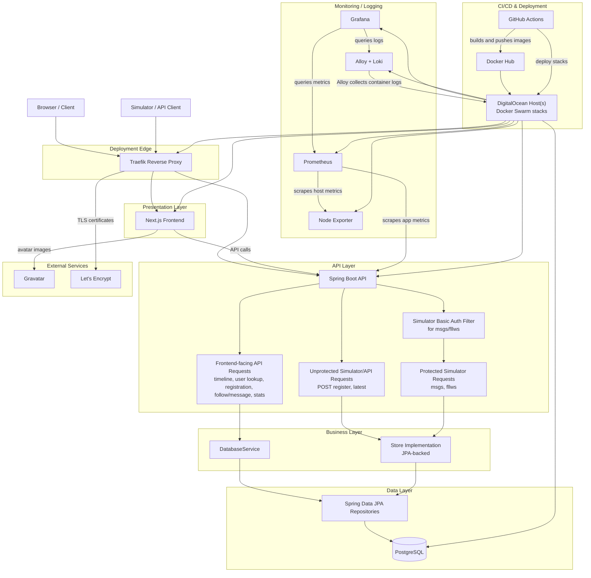

# ITU MiniTwit DevOps Project

MiniTwit implementation for the ITU DevOps course. The repository contains a
Spring Boot backend, a Next.js frontend, PostgreSQL persistence, Docker Compose
setups, Docker Swarm stack files, Terraform infrastructure files, GitHub Actions
workflows, and monitoring/logging configuration.

This README only describes information visible in files in this project
checkout.

## Features

- Public timeline and user timeline UI.
- User registration and login UI.
- Posting messages from the timeline UI.
- Follow and unfollow actions in the UI.
- Simulator-style backend endpoints for `/register`, `/msgs`, `/fllws`, and
  `/latest`.
- Prometheus metrics endpoint exposed by Spring Boot Actuator.
- Grafana dashboards for system, business, and backend-log views.

## Tech Stack

| Area           | Files show                                                     |
| -------------- | -------------------------------------------------------------- |
| Backend        | Java 21, Spring Boot 4.0.2, Spring Web, Spring Data JPA, Maven |
| Frontend       | Next.js 16.1.6, React 19.2.3, Tailwind CSS, npm                |
| Database       | PostgreSQL 16 in Docker Compose and Swarm files                |
| Monitoring     | Prometheus, Grafana, node-exporter, Micrometer                 |
| Logging        | Grafana Alloy, Loki, Grafana, SLF4J, Log4j                     |
| Deployment     | Docker, Docker Compose, Docker Swarm, Traefik                  |
| Infrastructure | Terraform with DigitalOcean provider                           |
| CI/CD          | GitHub Actions, Docker Hub image publishing, Cosign signing    |

## Architecture

<details>

<summary>Architecture Diagram (click to expand)</summary>



</details>
<br></br>
Our setup uses two Ubuntu-based DigitalOcean droplets. The primary server hosts the PostgreSQL database, Traefik reverse proxy/load balancer, and acts as the Docker Swarm manager. The second server acts as a Docker Swarm worker and hosts the frontend and backend application services. Docker Swarm coordinates deployment and service management across both servers.
<br></br>
The application is a Twitter-inspired system with a React/Next.js frontend and a Java 21 Spring Boot backend API. The frontend serves the client-facing interface, while the backend handles requests and communicates with the database. PostgreSQL runs as a Docker container with persistent storage and is only accessible internally on port 5432.
<br></br>
Monitoring and logging are handled using Prometheus, Loki, and Grafana, which are described in later sections.

## Repository Layout

| Path                      | Purpose                                                               |
| ------------------------- | --------------------------------------------------------------------- |
| `devops_backend/`         | Spring Boot backend source, Maven config, resources, and Dockerfile.  |
| `devops_frontend/`        | Next.js frontend source, npm config, styles, assets, and Dockerfile.  |
| `docker-compose.yml`      | Local stack with app, database, monitoring, and logging services.     |
| `docker-compose.ci.yml`   | Backend + PostgreSQL stack used by API tests.                         |
| `docker-compose.prod.yml` | Image-based Compose stack.                                            |
| `swarm/`                  | Swarm stack files for app, Traefik proxy, monitoring, and visualizer. |
| `monitoring/`             | Prometheus config and Grafana provisioning files.                     |
| `alloy/config.alloy`      | Docker log discovery and Loki forwarding config.                      |
| `terraform/`              | DigitalOcean droplet definitions and ignored Terraform state files.   |
| `.github/workflows/`      | Backend CI, frontend CI, CD, and report PDF workflows.                |
| `test.py`                 | Backend API tests.                                                    |
| `test_ui.py`              | Playwright UI tests with mocked API responses.                        |
| `LOGGING.md`              | Short logging explanation.                                            |
| `report/report.md`        | Course report Markdown file with section headings.                    |

The repo also tracks some generated/binary artifacts, including `__pycache__/`,
`devops_backend/bin/`, `.DS_Store` files, JPEG diagrams in `docs/`, and
`devops_frontend/app/favicon.ico`.

## Application Overview

The backend application name is `itu_minitwit`, and
`devops_backend/src/main/resources/application.properties` sets `server.port` to
`5001`.

Backend routes visible in controller files:

- General web/API routes: `GET /`, `/user`, `/register`, `/spec_user`,
  `/is_followed`, `/follow`, `/unfollow`, `/add_message`, `/stats`, and
  `/ping`.
- Simulator/API-test routes: `POST /register`, `GET /latest`, `/msgs`, and
  `/fllws`.

`SimulatorAuthFilter.java` protects paths starting with `/msgs` and `/fllws`
with a fixed Basic Auth header. `test.py` uses `simulator:super_safe!`.

The frontend app files are in `devops_frontend/app/`:

- `/` redirects to `/timeline`.
- `/timeline` renders the timeline UI.
- `/login` renders the login UI.
- `/register` renders the registration UI.

The frontend builds API URLs from `NEXT_PUBLIC_API_HOST` and
`NEXT_PUBLIC_API_PORT`.

## Configuration

Backend defaults in `application.properties`:

| Setting                         | Value                                            |
| ------------------------------- | ------------------------------------------------ |
| `server.port`                   | `5001`                                           |
| `MINITWIT_DB_URL` fallback      | `jdbc:postgresql://167.172.111.97:5432/minitwit` |
| `MINITWIT_DB_USER` fallback     | `minitwit_user`                                  |
| `MINITWIT_DB_PASSWORD` fallback | `minitwit_password`                              |
| exposed actuator endpoints      | `health,info,prometheus`                         |

Frontend local env file:

```env
NEXT_PUBLIC_API_HOST=http://localhost
NEXT_PUBLIC_API_PORT=5001
```

Ports in `docker-compose.yml`:

| Service    | Host port |
| ---------- | --------- |
| frontend   | `3000`    |
| backend    | `5001`    |
| PostgreSQL | `5432`    |
| Prometheus | `9090`    |
| Grafana    | `3001`    |
| Loki       | `3100`    |
| Alloy      | `12345`   |

`docker-compose.yml` uses `${GRAFANA_PASSWORD}` for Grafana's admin password.

## Installation and Usage

Run the local Docker Compose stack:

```bash
GRAFANA_PASSWORD=<local-password> docker compose up --build
```

Open the frontend:

```text
http://localhost:3000
```

Useful backend checks:

```bash
curl http://localhost:5001/ping
curl http://localhost:5001/actuator/health
curl http://localhost:5001/actuator/prometheus
```

Stop the local stack:

```bash
docker compose down -v
```

Run the backend directly:

```bash
cd devops_backend
mvn spring-boot:run
```

Run frontend commands:

```bash
cd devops_frontend
npm install
npm run dev
npm run build
npm run start
npm run lint
```

The frontend Dockerfile uses Node `20-alpine`, runs `npm ci`, builds with
`npm run build`, exposes port `3000`, and starts Next on `0.0.0.0:3000`.

## Tests

Backend API tests:

```bash
docker compose -f docker-compose.ci.yml up -d --build backend
pytest -v -x test.py
docker compose -f docker-compose.ci.yml down -v
```

Frontend UI tests are present in `test_ui.py` and use Playwright route mocks.
The frontend CI workflow installs Playwright dependencies, but its test step is
an `echo` TODO rather than `pytest -v -x test_ui.py` because of some problems we had.

Backend Maven tests:

```bash
cd devops_backend
mvn test
```

Frontend lint:

```bash
cd devops_frontend
npm run lint
```

## CI/CD

`ci_backend.yml` runs Maven tests, starts `docker-compose.ci.yml`, runs
`test.py`, runs Hadolint on the backend Dockerfile, and builds/pushes/signs the
backend Docker image outside pull requests.

`ci_frontend.yml` starts the full Compose stack, waits for frontend/backend
URLs with `curl`, installs Playwright dependencies, runs ESLint, and
builds/pushes/signs the frontend Docker image outside pull requests.

`cd.yml` runs on pushes to `main` and manual dispatch. It SSHes to
`167.172.111.97` as `root`, runs `git pull` in `/root/devops`, and deploys the
Swarm stacks:

```bash
docker stack deploy --compose-file swarm/proxy-stack.yml proxy --resolve-image always
docker stack deploy --compose-file swarm/app-stack.yml app --resolve-image always
docker stack deploy --compose-file swarm/docker-swarm-ui.yml swarm --resolve-image always
docker stack deploy --compose-file swarm/monitoring-stack.yml monitoring --resolve-image always
```

`build-report.yml` builds `report/report.md` into a PDF artifact.

## Deployment Files

`swarm/proxy-stack.yml` configures Traefik `v3.6` with ports `80`, `443`, and
`5001`, HTTP-to-HTTPS redirection, access logs, Let's Encrypt using
`${ACME_EMAIL}`, and the Docker Swarm provider.

`swarm/app-stack.yml` configures:

- Backend image `andersfrimann/devops_backend:main` with `3` replicas.
- Frontend image `andersfrimann/devops_frontend:main`.
- PostgreSQL `16`, constrained to `node.hostname == MiniTwit-Database`.
- External network `minitwit-public` and overlay network `backend-db`.
- Traefik routes for `api.rollbackandrelax.dk` and `rollbackandrelax.dk`.

`swarm/monitoring-stack.yml` configures node-exporter, Prometheus, Loki, Alloy,
and Grafana. Alloy is global. Grafana has a Traefik route for
`grafana.rollbackandrelax.dk`.

`swarm/docker-swarm-ui.yml` configures `dockersamples/visualizer:latest` with a
Traefik route for `swarm.rollbackandrelax.dk`.

## Monitoring and Logging

Prometheus scrapes:

- `backend:5001` at `/actuator/prometheus`
- `node-exporter:9100`

Grafana provisioning defines:

- Prometheus datasource at `http://prometheus:9090`
- Loki datasource at `http://loki:3100`
- Dashboard provider path `/etc/grafana/provisioning/dashboards`

Tracked dashboards:

- `systemDashboard.json`
- `businessDashboard.json`
- `minitwit-logs.json`

See [LOGGING.md](LOGGING.md) for the logging summary.

## Infrastructure

`terraform/provider.tf` uses the DigitalOcean provider and defines:

| Resource                     | Name                | Region | Size          | Image              |
| ---------------------------- | ------------------- | ------ | ------------- | ------------------ |
| `digitalocean_droplet.node`  | `MiniTwit-Database` | `fra1` | `s-2vcpu-4gb` | `ubuntu-24-04-x64` |
| `digitalocean_droplet.node2` | `MiniTwit-Worker`   | `fra1` | `s-1vcpu-2gb` | `ubuntu-24-04-x64` |

Both resources set `backups = true` and `monitoring = true`.

## Contributing Changes

The workflow files show this path for changes intended to reach the configured
Swarm deployment:

1. Change code, configuration, or documentation.
2. Run the relevant local commands from [Tests](#tests).
3. Open a pull request to `main`
4. Let the configured GitHub Actions workflows run.
5. Merge or push to `main` to trigger the configured CD workflow.

## Team

**RollbackAndRelax** — MSc DevOps, IT University of Copenhagen, Spring 2026

- Alperen Aydin
- Maria Møller
- Juliane Falsig Hvid
- Anders Frimann
