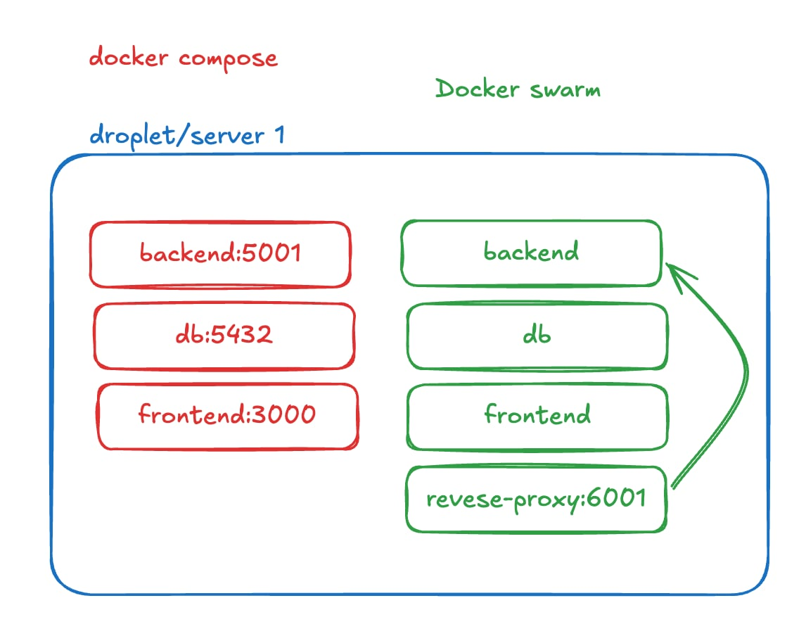
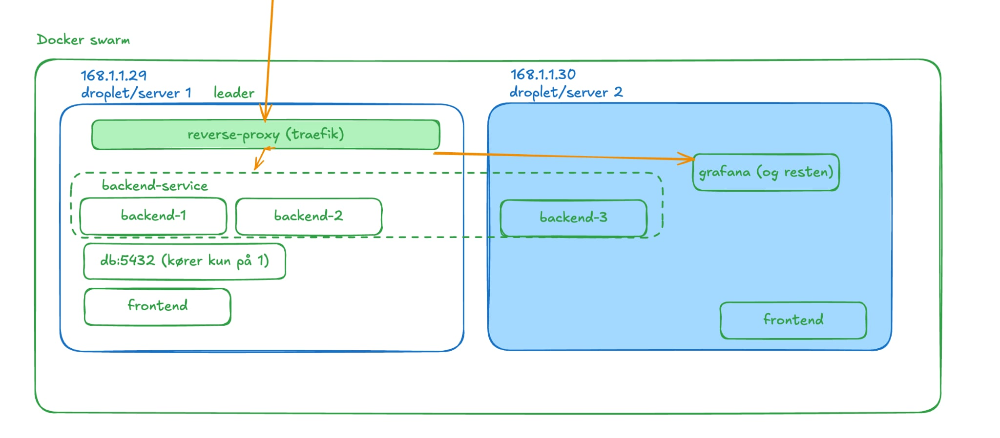

ITU Devops Course Project


## Docker swarm

Our current swarm is concisiting of 1 node, with multiple stacks. The current stacks are:

- `proxy` Reverse proxy: This handles all requests, and forwards them to our services (curerntly only backend)
- `app` Application: This is the backend, frontend and db

```
# ssh into server
root@MiniTwit-Database:~# docker stack ls
NAME      SERVICES
app       3
proxy     1
```


The reverse proxy UI runs on port 8080 of the server. 
It exposes port 6001 that routes to the backend.

It currently runs next to our docker compose setup, so we don't have any down time.




In the buttom of `proxy` swarm file we create a network, which is used by `app` stack and `proxy` stack.
 Without the network the reverse proxy cannot see there services. 


### Plan for swarm

We want to use two nodes, to handle more requests (and see if our swarm cluster works with multiple servers)

The target setup is in a picture below. The Orange arrows are requests




### TODO for swarm
- [ ] Github actions
- [ ] HTTPS
- [ ] add droplet with terraform
- [ ] Observability stack
- [ ] Backup DB and restore in swarm
- [ ] Remove old compose setup, and replace with swarm (change backend port for swarm to 5001)


### How to deploy
The stacks lives in folder `swarm`
you apply the two differnet stacks with

```
# Update proxy stack
docker stack deploy --compose-file swarm/proxy-stack.yml proxy
```

```
# Update app stack
docker stack deploy --compose-file swarm/app-stack.yml app
```

### Useful commands

See all stacks

```
root@MiniTwit-Database:~# docker stack ls
NAME      SERVICES
app       3
proxy     1
```

See all services in a stack

```
root@MiniTwit-Database:~# docker stack ps app
ID             NAME             IMAGE                                NODE                DESIRED STATE   CURRENT STATE          ERROR     PORTS
k84ogvtjz7l8   app_backend.1    andersfrimann/devops_backend:main    MiniTwit-Database   Running         Running 24 hours ago
3d71c12xf1ci   app_db.1         postgres:16                          MiniTwit-Database   Running         Running 24 hours ago
keuk1r0iuul5   app_frontend.1   andersfrimann/devops_frontend:main   MiniTwit-Database   Running         Running 24 hours ago
```

See logs from service in a stack

```
root@MiniTwit-Database:~# docker service logs app_frontend
app_frontend.1.keuk1r0iuul5@MiniTwit-Database    |
app_frontend.1.keuk1r0iuul5@MiniTwit-Database    | > minitwit-frontend@0.1.0 start
app_frontend.1.keuk1r0iuul5@MiniTwit-Database    | > next start -H 0.0.0.0 -p 3000
app_frontend.1.keuk1r0iuul5@MiniTwit-Database    |
app_frontend.1.keuk1r0iuul5@MiniTwit-Database    | ▲ Next.js 16.1.6
app_frontend.1.keuk1r0iuul5@MiniTwit-Database    | - Local:         http://localhost:3000
app_frontend.1.keuk1r0iuul5@MiniTwit-Database    | - Network:       http://0.0.0.0:3000
app_frontend.1.keuk1r0iuul5@MiniTwit-Database    |
app_frontend.1.keuk1r0iuul5@MiniTwit-Database    | ✓ Starting...
app_frontend.1.keuk1r0iuul5@MiniTwit-Database    | ✓ Ready in 1590ms
```
