\newpage

# Introduction
This report documents the development, operation, and maintenance of our ITU-MiniTwit system. A Twitter-inspired platform built for the MSc course in DevOps, Software Evolution and Software Maintenance. Starting from a legacy Python 2 application, we re-engineered it into a modern, containerized stack and operated it under realistic conditions while applying DevOps principles throughout. The following sections present the system's architecture and dependencies, our CI/CD pipeline and operational setup, and our reflections on the challenges encountered along the way.

# System's Perspective

## Design and Architecture
Our setup consists of two DigitalOcean droplets based on Ubuntu, orchestrated using Docker Swarm. The primary server acts as the Swarm manager, hosting the database and the reverse proxy (based on Traefik). The other server acts as a Swarm worker and hosts the frontend. Both nodes run backend replicas, and traffic is distributed between them through the reverse proxy

The core application is a Twitter inspired application consisting of a frontend part, which is client facing and an API which acts as middle layer between client requests and our database. The former is written in React/NextJS and the latter is written in Java 21 using Spring Boot. The stack was chosen as modern frontend development is centered around single page applications, which emphasizes that most processing is carried out primarily by the client whereas the server merely distributes the application. Java was chosen as the backend language primarily because of its large ecosystem of out-of-the-box libraries in order to expose endpoints, database communication, libraries for (de)serialization. Also, the language  is cross-platform compatible by design and it is the language we are most experienced in. 

Our database is a standard Postgres installation running as a Docker container with a persistent volume for persisting data under port 5432, which is only accessed internally by applications. 

We monitor and log the system using Prometheus, Loki and Grafana. The monitoring and logging stack is described in section 3.2 and 3.3 respectively. 

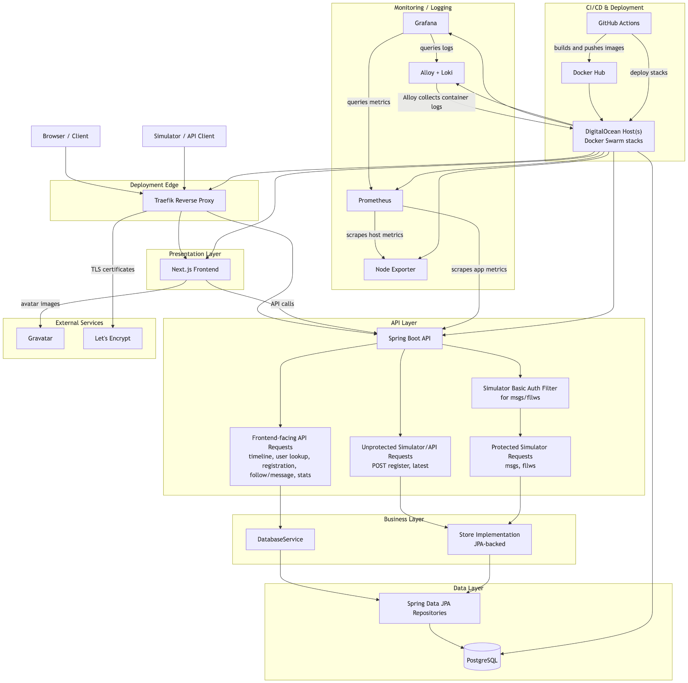
*Figure 1: Architecture of the ITU-MiniTwit system.*

## Dependencies

At figure 2 below is a dependency graph of the technologies and tools the project is built on, grouped by level of abstraction. The lines between indicates the dependency of the components where each component points downwards to what it itself depends on.

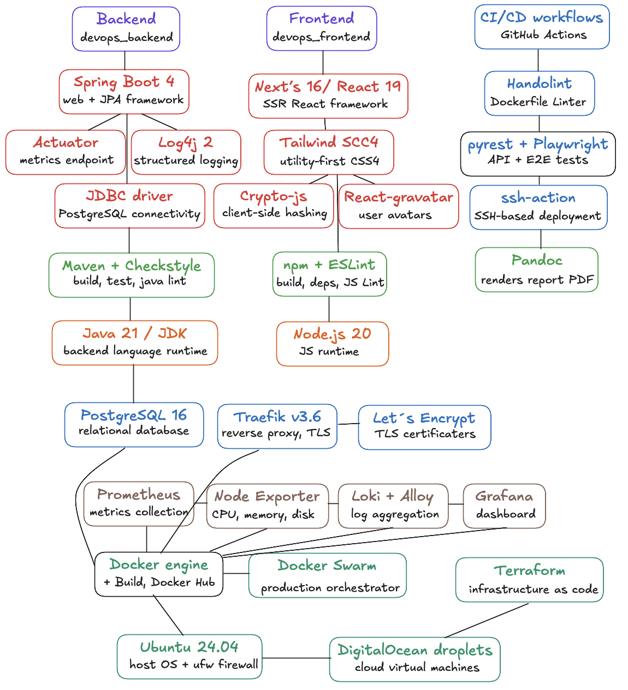
*Figure 2: Dependencies.*

## Current State

We use SonarQube and Codacy for static analysis.

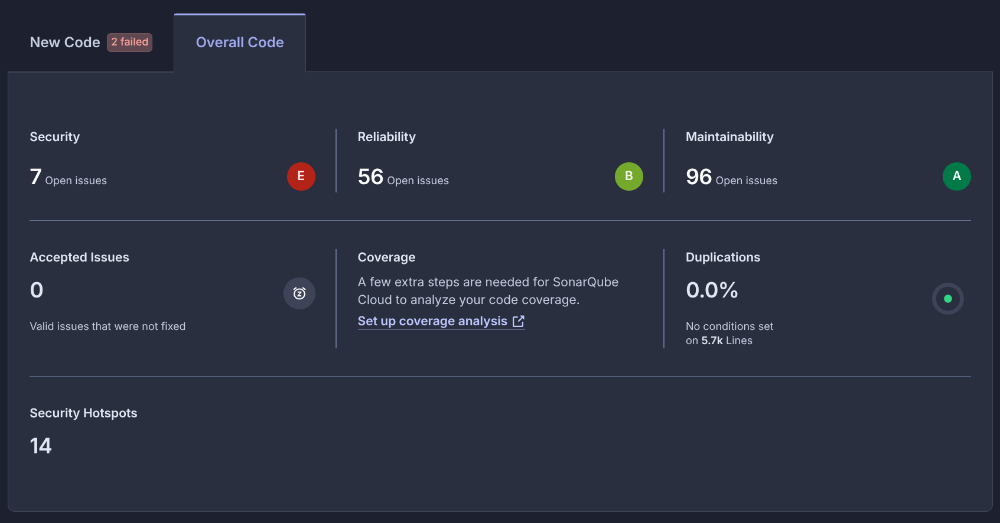
*Figure 3: SonarQube issues.*

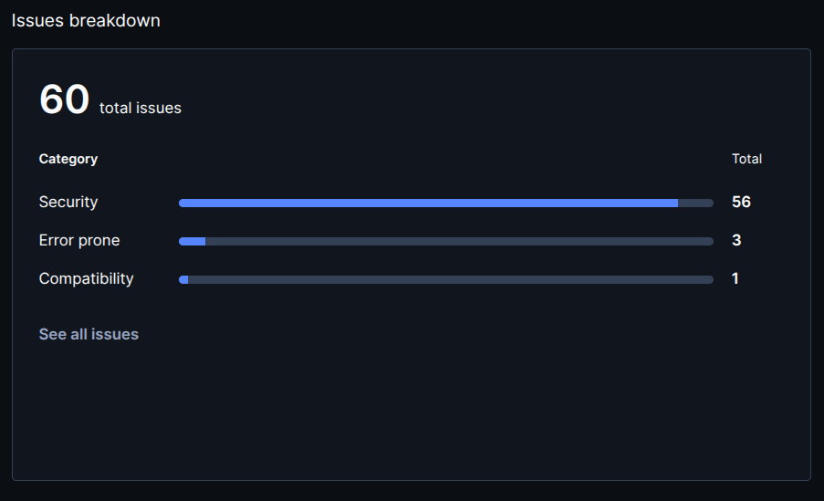
*Figure 4: Codecy issues.*

SonarQube's quality gate fails due to security issues, with ratings of E in security, B in reliability, and A in maintainability (see figure 3). Codacy gives an overall grade of A with 5.1 issues per thousand lines of code, though 56 of 60 total issues are security-related (see figure 4). Security is the main concern across both tools.
Our test suite consists of API integration tests covering the core endpoints and Playwright end-to-end tests in CI. We do not have unit tests, and test coverage reporting is not integrated into our static analysis tools.

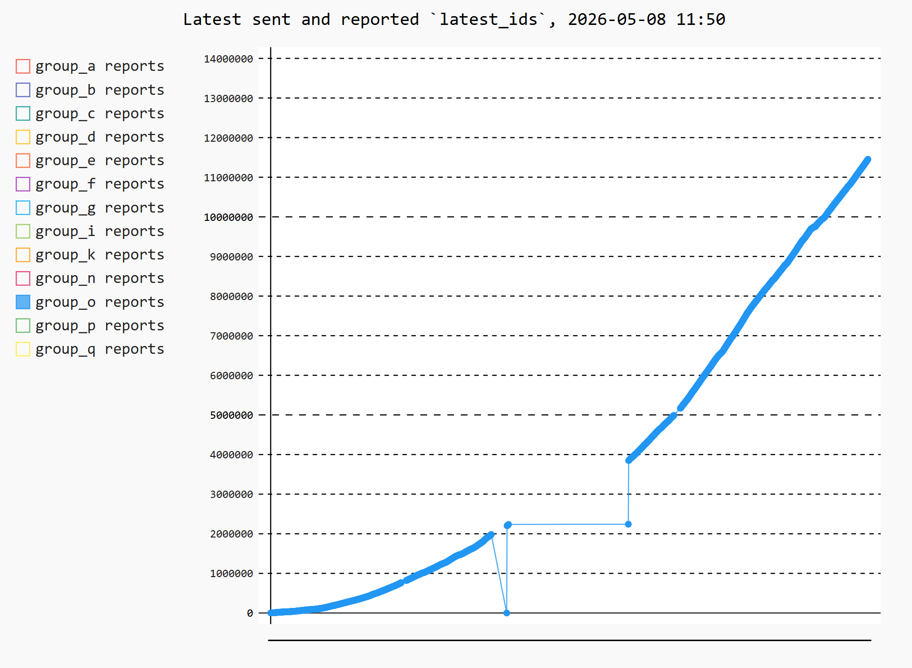
*Figure 5: Simulator responses.*

From our Grafana monitoring data, the API had a median response time of 12.3 ms and a p99 of 79.9 ms during the simulator period, peaking at 504 ms under high traffic. During sustained request flooding, as described in the Security Hardening section, CPU reaches 100% and the application becomes unresponsive. We have not consistently measured downtime, but have experienced it during database migration, the move from AWS to DigitalOcean, and over Easter due to the simulator not being restarted correctly (see figure 5).

# Process Perspective

## CI/CD Pipeline

The two CI workflows are triggered on pull requests and pushes to main which is illustrated on figures 6 and 7. On pull requests, images are built but not pushed and no deployment occurs, serving as a verification step before code reaches main.The backend CI runs API integration tests against a containerized backend using our Python test suite and Dockerfile linting with Hadolint. The frontend CI runs ESLint for static analysis and has a placeholder for Playwright end-to-end tests which is currently disabled because we ran into some issues when implementing https, Traefik and Docker Swarm. Both workflows build Docker images and, on pushes to main, push them to Docker Hub and sign them using cosign.

The CD workflow triggers on pushes to main, waits for all CI workflows to complete, then SSHes into the manager node and runs ‘docker stack deploy’ for each of our four stacks: the reverse proxy, application, Swarm management UI, and monitoring.

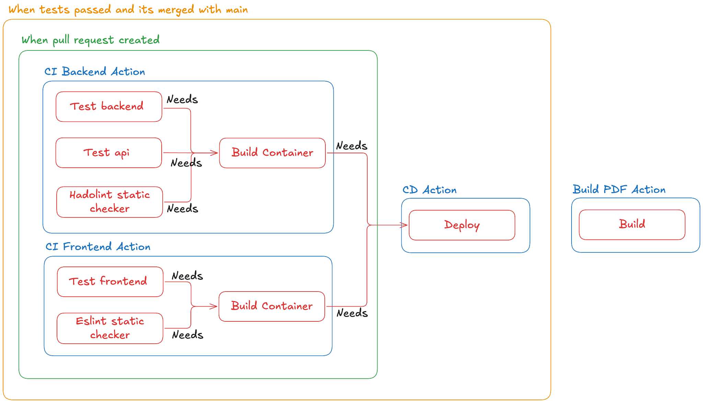
*Figure 6: Github Actions overview.*

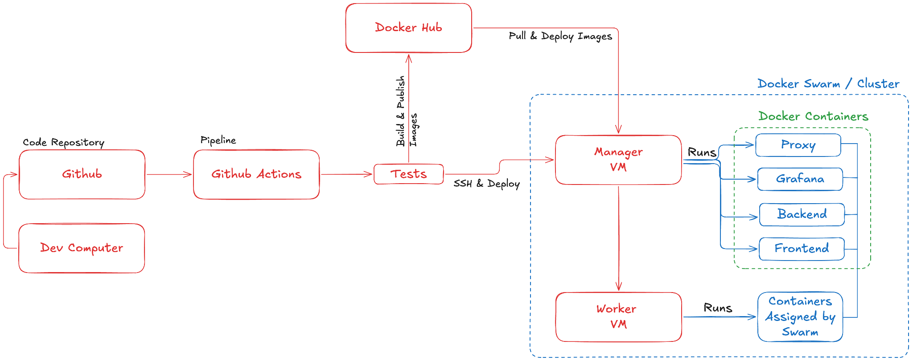
*Figure 7: Deployment architecture and CI/CD pipeline.*

We use Terraform to set up the DigitalOcean infrastructure. Our configuration defines two droplets, one for the database and Swarm manager, and one for the worker node, with backups and monitoring enabled, placed within the same VPC for internal communication.

Our Terraform setup only covers the initial provisioning. Installing Docker Engine, initializing the Swarm cluster, and assigning manager/worker roles are done manually. Ideally, we would automate these steps along with firewall rules and environment variable injection to achieve a one-click-up solution.

## Monitoring

We use Prometheus as our metrics collection engine. It uses a pull-based approach to scrape two targets: Spring Boot Actuator for application metrics such as HTTP request counts and response times, and node-exporter for infrastructure metrics such as CPU, memory, and disk usage. We also added custom metrics, to include user counts and per-profile follower counts. The collected data is visualized in Grafana where we built two dashboards aimed at different concerns.

### Systems & operations

The systems & operations dashboard contains panels for backend health status, request rates split by simulator and user traffic, error rates, response times, and resource usage. This dashboard is designed to answer questions like "Is something broken?", "Are we running out of resources?", and "How fast is the page responding?". After running out of disk space on the server (see section X), we added a dedicated disk usage panel with a threshold alert at 70% to prevent that from happening again. The request rate panel reveals which endpoints are called the most and could be candidates for optimization, while the response time panel helps identify slow endpoints where refactoring could have the most impact.

### Business

The business dashboard tracks total registered users, messages posted, follow relationships, and a top 10 most-followed profiles table. It is designed to answer questions like "How many users do we have?", "How active are they?", and "Which profiles have the most followers?", giving insight into platform growth and identifying influencers.

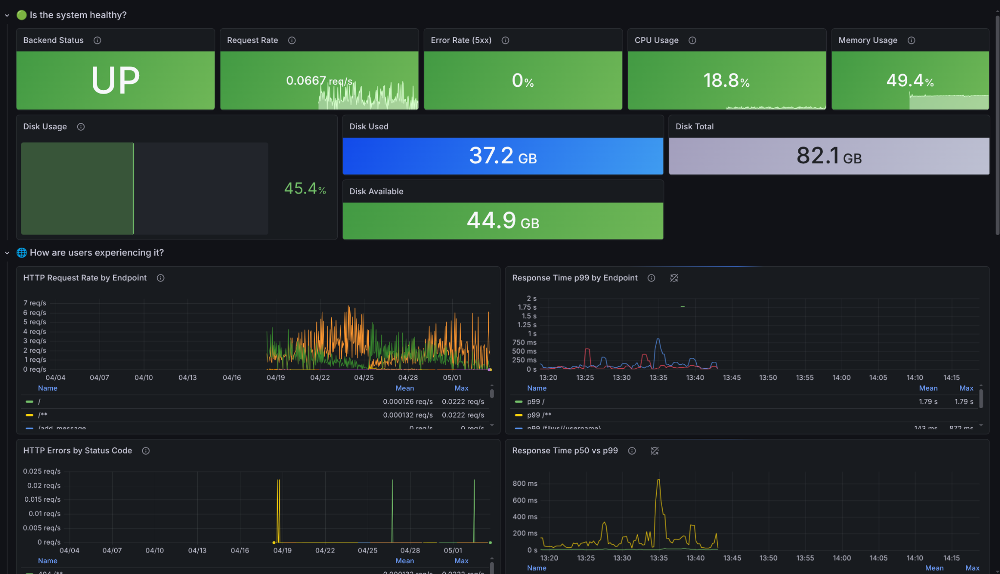
*Figure 8: Grafana monitoring systems and operations dashboard.*

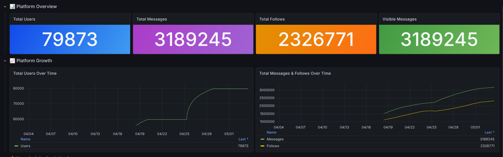
*Figure 9: Grafana monitoring business dashboard.*

## Logging

Our backend logs application activity using SLF4J and Log4j. We log requests to key endpoints, successful actions (registration, message posting, following/unfollowing), warnings and errors (bad requests, missing users, invalid payloads, database failures), and debugging context such as usernames, request parameters, and resource counts.
Logs are aggregated through a pipeline of Grafana Alloy, Loki, and Grafana. Alloy discovers Docker containers, attaches container and service labels, and forwards logs to Loki for storage. Grafana is provisioned with a Loki datasource and a dashboard with panels for backend logs, warnings, errors, and activity flows such as follows, messages, and registrations.
A few limitations remain: the logs dashboard only covers the backend, there is no request correlation ID for tracing requests across services, and some log lines include user-identifying values such as usernames and email addresses which ideally should be sanitized.
Grafana queries Loki with backend filters such as the ones seen in figure 10. Figure 12 shows a screenshot of the logs in Grafana.

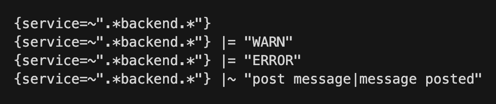
*Figure 10: Grafana queries.*

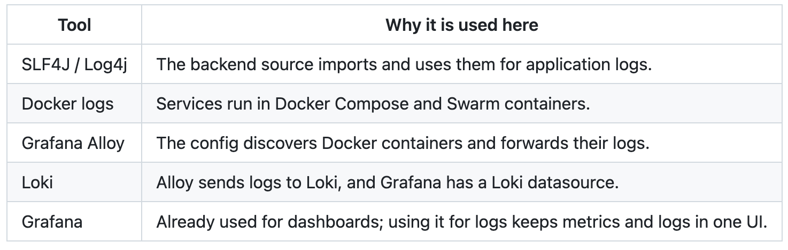
*Figure 11: Tools for logging.*

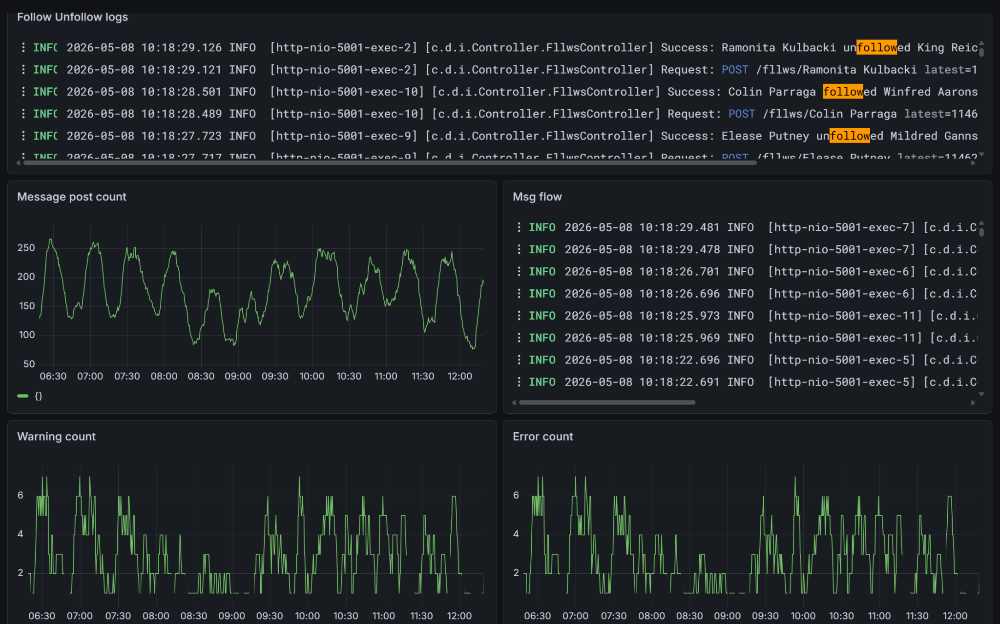
*Figure 12: Grafana Logging dashboard.*

## Security Hardening

Our security strategy is centered around minimizing the attack surface by restricting external access to our services. We achieve this at the Docker level by only exposing the ports used by the Traefik reverse proxy. All other services, including our PostgreSQL database and application containers, are only accessible internally through Docker Swarm's overlay network and are not reachable from the internet.

HTTPS is enforced on all public-facing endpoints using Traefik's built-in ACME/Let's Encrypt integration, which automatically manages the lifecycle of our TLS certificates. Internal communication between the reverse proxy and application services runs over HTTP within the Swarm overlay network.

Access to our servers is restricted to SSH key authentication, and our CI/CD pipeline uses dedicated deployment keypairs for automated deployments, avoiding the use of passwords entirely.

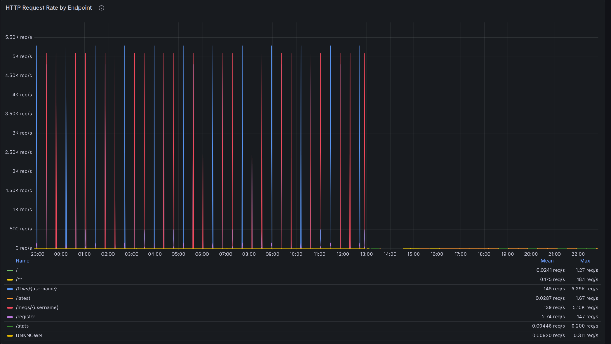
*Figure 13: Screenshot from grafana dashboard showing repeated bursts of requests.*

As seen on the screenshot from Grafana our API has been hit by repeated bursts of around 5,000 requests per second targeting the /fllws/{username} and /msgs/{username} endpoints. These spikes follow a regular pattern over several hours, which points to some form of automated tooling. During these periods, CPU usage hits 100% and the server becomes unresponsive. We have not implemented any rate limiting or IP blocking to deal with this, so for now it remains an unresolved issue.

## Availability and Scaling

Our frontend application runs as a single replica on the worker node, while the backend application runs as three replicas distributed across both the worker and manager node. Docker Swarm handles self-healing by automatically restarting containers that crash, and with three backend replicas the API can tolerate individual container failures without going fully offline.

Traffic is distributed using Traefik as a reverse proxy in conjunction with Docker Swarm's ingress routing mesh, which balances incoming requests across available replicas. 

Our setup has several single points of failure. Our database runs as a single PostgreSQL instance with no replication. In an ideal setup, we would have a primary and a failover instance with continuous replication, ensuring synchronization up to a point corresponding to our desired replication rate. Similarly, our Traefik reverse proxy and our Swarm manager node are both single instances, if either goes down, the entire system becomes unreachable or unmanageable. Ideally, we would have backup instances with a heartbeat mechanism to take over in case the primary stops responding. Lastly, we have not implemented any auto scaling, so the number of replicas is static regardless of traffic load.

# Reflection Perspective

One of the biggest issues we encountered was an operation problem with our AWS server, which broke down because it ran out of disk space. The last system log entry was “no more disk”, and we were not even able to SSH into it, so we had to spin up a new server. The most serious consequence was that we lost the entire database. Luckily, we had downloaded a CSV file with all the data a few days earlier when we migrated the database, so we were able to regenerate it from those files, but we still lost a fair amount of data. This was an important lesson learned. In future projects we will need to keep regular backups of our database.

A few weeks later, we became aware that our AWS server was getting really expensive so we switched to DigitalOcean. On the positive side, this meant we got to try two different platforms and gained hands-on experience with both. We had to shut down the AWS server fairly quickly to avoid spending more money, which caused some downtime before we managed to set up the DigitalOcean server. 
A challenge we encountered in the project, related to Evolution and Refactoring but also Maintenance, was the migration of our database. We started the project with a SQLite database, and decided to migrate to PostgreSQL. We chose PostgreSQL because it is free, open source, and is essentially an industry standard, which made it well documented. Overall, we managed the migration quite well, especially considering that database migrations are often a source of significant problems.
We also had the ambition of using Kubernetes, but after a couple of weeks we decided that it became too much. The level of complexity was not worth it in relation to what we were trying to achieve.

## DevOps Style of Work

We had the “DevOps” style of work in mind throughout the project, by trying to implement “The Tree Ways”: Flow, Feedback, and Continual Learning and Experimentation. 

Throughout the project, we used GitHub's project management tool to make work visible through issues, which were continuously created, assigned, and updated. We broke tasks down into smaller pieces to make them easier to delegate, test, and deploy via our CI/CD pipeline. A big difference from other projects we have done was the replacing of manual work with automation.

We have realised the importance of the Feedback principle throughout the project work. Making comments and notes in our GitHub repo has been very useful later on. We agree that we could have done even better on this point to create work visibility and make it easier for other group members to familiarise themselves with each other's work. Once the simulator started, the project moved into software maintenance where some different things went wrong. At this point our monitoring and logging system made it possible to see problems as they occur and fix them as fast as possible.

Regarding the third principle, Continual Learning and Experimentation, the project pushed us to learn a lot of new tools and technologies throughout the course, which we then implemented in our work as we went along. Each session introduced something new, and we had to experiment with it and figure out how to integrate it into our existing setup. 

# Use of Generative AI

We used Claude Opus 4.6 from Anthropic throughout the project for writing code, debugging and exploring unfamiliar topics. Also a few figures including the architecture overview (Figure 1) was made with AI, and for the dependency graph (Figure 2) it helped ensure we captured all relevant technologies. It was especially helpful when implementing the monitoring stack and setting up static analysis. As students with limited programming experience, using AI made many tasks more approachable, though at times the volume of code it produced was overwhelming and required careful review. We have noted it as co-author in our commits whenever Claude Opus 4.6 has been used.

# Project Artifacts

Our MiniTwitt page:
https://rollbackandrelax.dk/

Git Repository: 
https://github.com/ITUdevopsGroup/devops.git

Monitoring and logging:
https://grafana.rollbackandrelax.dk/dashboards

Sonarcube issue tracker:
https://sonarcloud.io/project/overview?id=ITUdevopsGroup_devops

Codacy issue tracker:
https://app.codacy.com/gh/ITUdevopsGroup/devops/dashboard
